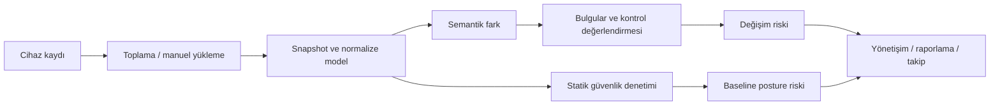
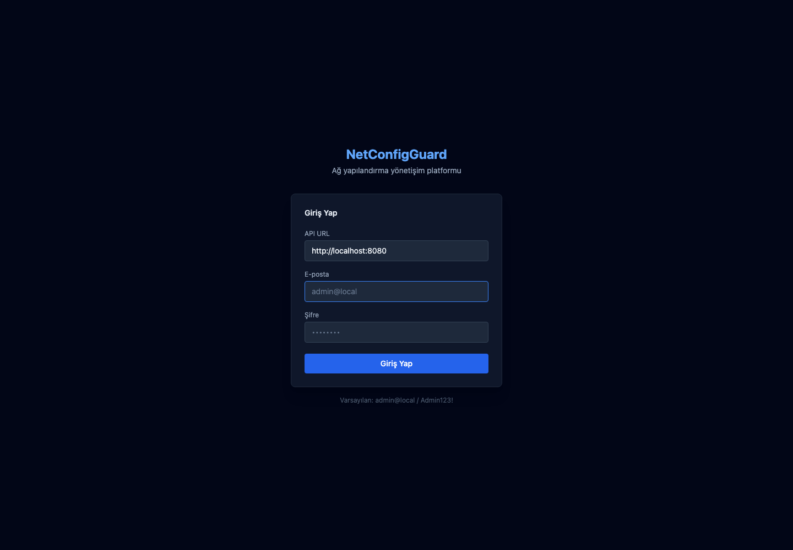
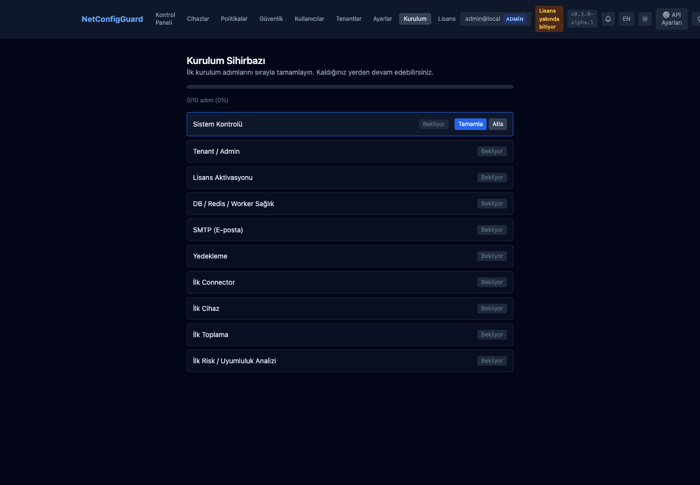

# NetConfigGuard

**Ağ yapılandırma yönetişimi: cihaz yapılandırmasından kanıta dayalı bulgu, risk ve raporlamaya.**

NetConfigGuard, farklı üreticilerin yapılandırma verilerini toplayıp sürümleyen; anlamlı değişiklikleri ve desteklenen güvensiz ayarları değerlendiren bir platformdur. Snapshot geçmişini, bulguları, kontrol referanslarını ve risk çıktılarını aynı inceleme akışında bir araya getirir.

**Sürüm:** `0.3.0-alpha.1` · **Model:** ticari uygulama, private kaynak · **Bu depo:** public ürün ve mühendislik anlatımı

[English overview](README.en.md) · [Uçtan uca kullanıcı yolculuğu](docs/user-journey.md) · [Doğrulama kapsamı](docs/validation.md) · [İletişim](#demo-ve-iletişim)

## Hangi problemi çözüyor?

Ağ yapılandırmalarında bir değişiklik cihazı çalışır durumda bırakırken yönetim erişimini veya güvenlik politikasını zayıflatabilir. Ham dosya farkı değişikliği gösterir; inceleme için değişen nesnenin, ilgili kontrolün ve güvenlik bağlamının da anlaşılması gerekir.

NetConfigGuard'ın amacı şu soruları birlikte ele almaktır:

- Cihazda hangi yapılandırma, ne zaman toplandı?
- Önceki snapshot'a göre hangi desteklenen nesne değişti?
- Mevcut yapılandırmada geçmişten bağımsız hangi güvensiz koşullar var?
- Hangi bulgu hangi kanıta ve kontrol referansına dayanıyor?
- Değişiklik ve mevcut güvenlik durumu nasıl önceliklendirilebilir?
- İşlem başarılı mı, analiz tamamlandı mı, hangi adım hata verdi?

[Ürün yaklaşımı ve temel kavramlar →](docs/product-overview.md)

## Uçtan uca nasıl çalışıyor?

1. **Ortam ve erişim:** Dağıtım, tenant/admin, ürün lisansı ve kurulum adımları hazırlanır.
2. **Cihaz kaydı:** Vendor ve bağlantı bağlamı kaydedilir; uygulanabilir connector için bağlantı testi yapılır.
3. **Toplama:** Asenkron job ile yapılandırma alınır veya manuel snapshot yüklenir.
4. **Geçmiş:** Ham içerik ve snapshot metadata'sı saklanır; iki snapshot karşılaştırılabilir.
5. **Analiz:** Vendor parser/normalizer kapsamındaki nesneler için semantik fark; desteklenen vendor'larda tek snapshot statik denetim değerlendirilir.
6. **Yönetişim:** Bulgu, kontrol ve risk verisi kanıt bağlamıyla sunulur.
7. **Takip:** Rapor, audit/job incelemesi, yapılandırılmış bildirim ve isteğe bağlı AI açıklaması kullanılır.
8. **Yeniden değerlendirme:** Operatörün uyguladığı düzeltme sonrası yeni snapshot ile ilgili durum tekrar incelenir.

İlk snapshot ile statik denetim uygulanabilir olabilir; değişiklik analizi için snapshot çifti gerekir. Her vendor her aşamada aynı kapsamı sağlamaz.

[Adım adım kullanıcı yolculuğu ve sequence diagram →](docs/user-journey.md)

## İki ayrı güvenlik bakışı

| Bakış | Girdi | Yanıtladığı soru |
| --- | --- | --- |
| Değişim bazlı değerlendirme | Baz ve hedef snapshot | Desteklenen yapılandırma değişiklikleri hangi inceleme sinyalini üretti? |
| Statik baseline / posture | Tek snapshot | Mevcut yapılandırmada desteklenen kurallara göre hangi güvensiz ayarlar var? |

Statik posture skoru, bulgu severity ağırlıklarından hesaplanıp 100'de sınırlandırılan bir öncelik göstergesidir; saldırı olasılığı yüzdesi değildir. Değişim riskinde ilgili vendor/kontrol eşlemeleri kullanılır. Kanıtı olmayan veya değerlendirilmemiş durum temiz sonuç olarak yorumlanmamalıdır.

[Analiz hattı, skor örneği ve framework sınırları →](docs/analysis-pipeline.md)

## Arayüzde neler var?

Ana çalışma alanları kontrol paneli, cihazlar, politikalar, güvenlik, kullanıcılar, tenantlar, ayarlar, kurulum ve lisanstır.

Cihaz detayında **Genel Bakış, Snapshot Geçmişi, Bulgular, Ticketlar, Güvenlik Denetimi, Risk, Uyumluluk, Raporlar, Denetim, İşler ve Chat** sekmeleri bulunur. Kullanıcı snapshot karşılaştırması, anlık toplama, bağlantı testi, manuel yükleme ve PDF rapor yollarına erişebilir; ilgili işlem yetki, lisans ve vendor kapsamına bağlıdır.

[Sayfa ve sekme rehberi →](docs/interface-guide.md)

## Vendor yaklaşımı

Firewall, switch/wireless, cloud policy, WAF/load balancer, IPS/IDS, identity ve endpoint alanlarında katalog girdileri vardır. FortiGate, Cisco IOS ve PAN-OS daha geniş scope'lu; Catalyst ve Aruba birden fazla kritik scope'lu analiz hattına sahiptir. Diğer girdiler foundation/narrow veya collectorless kapsamda ayrı değerlendirilir.

**Canlı cihaz L3 doğrulaması kayıtlı değildir.** Katalog üyeliği veya collector varlığı firmware/production doğrulaması değildir. Public kapsam tablosu canonical depth matrix'te yer alan **33 girdiyi** ve scope/collector/statik audit ayrımını gösterir; önceki ürün özetindeki 34 katalog sayısıyla aynı ölçüt gibi sunulmaz.

[Vendor bazında kapsam tablosu →](docs/vendor-coverage.md)

## Mimari ve teknoloji

| Katman | Teknoloji / yaklaşım |
| --- | --- |
| API ve Worker | Go; asenkron toplama ve uygulama kullanım senaryoları |
| Web | React 19, TypeScript, Vite, Tailwind, TanStack Query |
| Kalıcı veri | PostgreSQL 16; snapshot ve değerlendirme persistence |
| Destek servisleri | Redis 7 |
| Dağıtım | Docker/Compose, Kubernetes/Helm, offline paketleme |
| Gözlemlenebilirlik | Prometheus, Grafana, OpenTelemetry |
| Tasarım | Domain, application, parser, persistence ve HTTP sınırları |

Domain I/O'dan ayrıdır; application kullanım senaryoları ihtiyaç duyduğu interface'leri tanımlar. Worker collection işleri PostgreSQL job kayıtları ve polling akışıyla izlenir. Redis'in bulunması bütün işlerin Redis queue üzerinden yürütüldüğü anlamına gelmez.

[Mimari ve tasarım kararları →](docs/architecture.md) · [Mühendislik vaka anlatımı →](docs/portfolio-case-study.md)

## Erişim, offline lisans ve AI

JWT/API key, RBAC, MFA/TOTP ve yapılandırılmış OIDC yolları; tenant bağlamı ve device credentials için AES-256-GCM şifreleme bulunur. Ürün aktivasyonu backend'de offline Ed25519 imza doğrulamasıyla yapılır; tenant/modül/kota bağlamı erişimi etkiler.

İsteğe bağlı Anthropic veya Ollama üzerinden bulgu açıklaması, cihaz sohbeti, rapor özeti ve politika taslağı gibi yardımcı işlevler vardır. AI tavsiye niteliğindedir; bulgu, risk veya compliance kararının yerine geçmez.

[Erişim, lisans, AI ve bildirim sınırları →](docs/security-and-ai.md)

## Kurulum ve işletim

Offline installer schema'yı uygulama başlangıcından önce hazırlar, migration durumunu takip eder ve tekrar kurulumda tamamlanan migration'ları atlar. Dirty veya takip edilmeyen mevcut schema otomatik akışı durdurur. Production dış erişimi HTTPS ve metrics kısıtlamasıyla hazırlanmalıdır.

Job başarısı snapshot toplandığını gösterebilir; downstream bulgu/uyumluluk/risk adımlarının hepsinin başarılı olduğunu garanti etmez. Audit ve materialization outcome'ları bu ayrımı takip etmeye yardımcı olur.

[Dağıtım, TLS, migration, backup ve operasyon →](docs/deployment-and-operations.md)

## Gerçek arayüz

Görüntüler izole yerel ilk kurulum ortamından alınmıştır. Müşteri verisi veya uydurulmuş cihaz/bulgu içermez. Ekrandaki yerel hesap geliştirme kurulumuna aittir; public demo hesabı değildir. Henüz dolu analiz ekranları veya demo videosu yayımlanmamıştır.

### Giriş

### İlk kurulum

## Neler doğrulandı, neler sırada?

Alpha merge için **Go, Web, Helm ve Secret scan CI başarılıdır.** Yerelde PostgreSQL integration, race, production auth smoke, linux/arm64 offline temiz/tekrar kurulum, dirty-state reddi ve ayrı DB backup/restore doğrulaması yapılmıştır.

Kayıtlı L3 gerçek cihaz doğrulaması, bağımsız penetrasyon testi, production pilot kabulü ve hedef ölçekte performans/HA/DR kanıtı henüz yoktur. Linux/amd64 runtime doğrulaması yapılmamıştır. Framework eşlemeleri sertifikasyon veya hukuki uyumluluk kararı değildir.

[Detaylı doğrulama ve yol haritası →](docs/validation.md)

## Örnek inceleme senaryosu

Bir yapılandırma snapshot'ından sonra desteklenen yönetim ayarında değişiklik yapıldığını düşünelim. İkinci snapshot semantik fark için kaynak olur; ilgili kural uygulanabiliyorsa bulgu ve kontrol bağlamı üretilir. Operatör kanıtı inceleyip kendi değişiklik sürecinde düzeltir ve yeni snapshot ile tekrar değerlendirir.

Bu kavramsal senaryodur; canlı cihaz çıktısı, ürün benchmark'ı veya otomatik düzeltme iddiası değildir.

[Senaryoyu adım adım oku →](docs/example-workflow.md)

## Dokümantasyon rotası

| Okumak istediğin | Belge |
| --- | --- |
| Ürün problemi ve kavramları | [Ürün yaklaşımı](docs/product-overview.md) |
| Kurulumdan takip sürecine | [Kullanıcı yolculuğu](docs/user-journey.md) |
| Ekranların işlevleri | [Arayüz rehberi](docs/interface-guide.md) |
| Diff, bulgu, compliance ve risk | [Analiz hattı](docs/analysis-pipeline.md) |
| Vendor bazında yetenek | [Kapsam tablosu](docs/vendor-coverage.md) |
| Bileşenler ve katmanlar | [Mimari](docs/architecture.md) |
| Auth, lisans, AI ve alert | [Güvenlik ve AI](docs/security-and-ai.md) |
| Kurulum ve işletim | [Operasyon](docs/deployment-and-operations.md) |
| Mühendislik kararları | [Vaka anlatımı](docs/portfolio-case-study.md) |
| Test kanıtı ve eksikler | [Doğrulama](docs/validation.md) |

## Demo ve iletişim

Walkthrough, pilot görüşmesi veya izinli kaynak incelemesi için [Ertan Soyalp](https://github.com/Ertanso) ile iletişime geçebilirsiniz. Public interaktif demo bulunmamaktadır.

Uygulama kaynak kodu, container/kurulum arşivleri ve aktivasyon materyali private depoda tutulur. Bu public depo ürün dokümantasyonu ve arayüz görüntülerini sunar. Tüm hakları saklıdır; [LICENSE](LICENSE).
