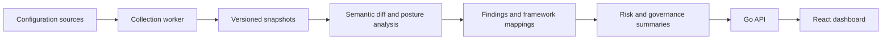

# NetConfigGuard

Network configuration governance — from configuration changes to explainable security findings.

**Status: 0.3.0-alpha.1 · Private commercial implementation · Public project showcase**

[Türkçe](README.tr.md) · [Architecture](docs/architecture.md) · [Validation & roadmap](docs/validation.md) · [Illustrative workflow](docs/example-workflow.md)

## The problem

Network configuration changes can introduce insecure settings that are difficult to track across device families. NetConfigGuard brings snapshots, semantic changes, security findings, framework mappings and risk summaries into one governance workflow.

## What it does

- Collects and versions configuration snapshots; compares meaningful configuration changes.
- Evaluates static posture as well as changes between snapshots.
- Maps findings to ISO 27001, CIS Controls v8 and KVKK references. Mappings do not constitute certification or a legal compliance determination.
- Offers a React dashboard, role-based access, MFA/TOTP, OIDC and tenant-aware workflows.
- Supports Docker/Compose, Helm and offline installation with local license verification.
- Keeps optional AI explanations advisory; deterministic analysis produces the underlying findings.

The catalog contains **34 vendor entries**, with different collector and analysis coverage. This is not a claim of 34 production-validated integrations. No L3 live-device validation is recorded for this alpha.

## Architecture

**Stack:** Go · React 19 · TypeScript · PostgreSQL 16 · Redis 7 · Docker · Helm · Prometheus · OpenTelemetry.

## Actual interface

Screenshots are from an isolated local first-run environment. They show login and setup, without customer data, populated device dashboards or fabricated findings. The displayed local account is a development setup account, not a public demo login.

### Login

### First-run setup

## Engineering evidence

Go, Web, Helm and secret scanning CI passed for the alpha merge. Local checks include PostgreSQL integration, race checks, production authentication smoke, offline clean/repeat installation and backup/restore. The tested offline target is **linux/arm64**. See [validation and limitations](docs/validation.md).

## Next milestones

Live-device lab evidence, broader platform testing, independent security assessment and a measured pilot deployment. This alpha does not claim production readiness.

## Demo and contact

For a walkthrough, pilot discussion or permitted source review, contact [Ertan Soyalp on GitHub](https://github.com/Ertanso). There is no publicly hosted interactive demo or demo video in this repository yet.

The application source, deployment archives and activation material remain private. This repository contains project documentation and screenshots only. All rights reserved; see [LICENSE](LICENSE).
