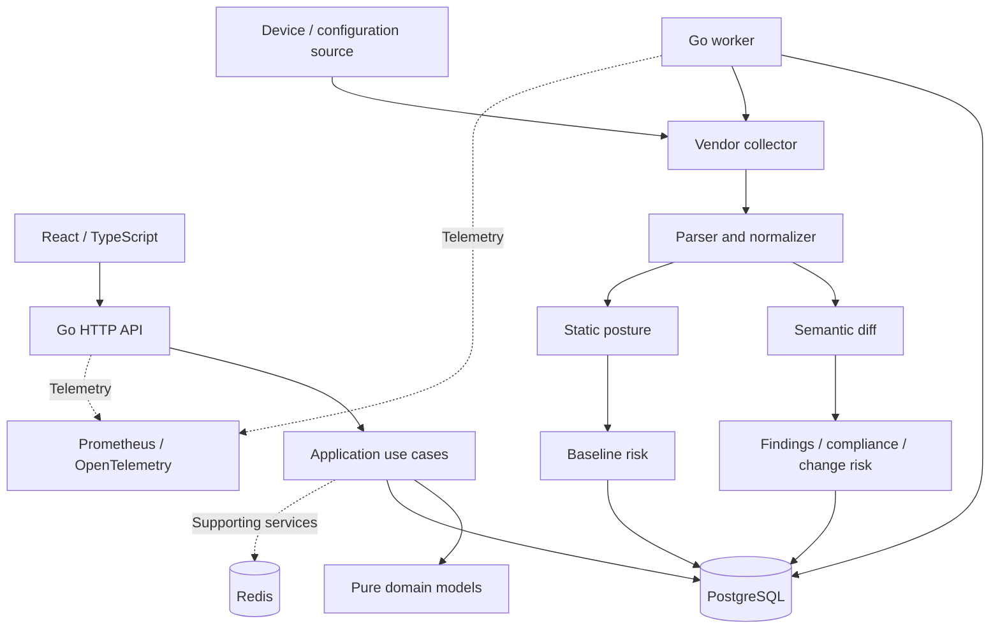

# Architecture and implementation boundaries

The Go API serves the React/TypeScript dashboard. Application use cases depend on interfaces; PostgreSQL adapters implement persistence. The worker processes persisted collection jobs and invokes applicable vendor analysis. Redis is a supporting dependency, not evidence of a Redis-only job queue.

## Layers

| Boundary | Responsibility |
| --- | --- |
| Domain | Models and shared concepts without I/O |
| Application | Tenant-aware use cases and consumer-defined interfaces |
| Vendor parsing | Supported raw formats, semantic objects and normalization |
| Persistence | PostgreSQL implementation of repository contracts |
| HTTP | Authentication/request context, handlers and response mapping |
| Worker | Collection lifecycle and applicable governance materialization |
| Web | Querying and presenting application data with device/snapshot context |

## Why these boundaries matter

Snapshot storage is distinct from collection execution. Collection completion is distinct from downstream analysis persistence. Findings, control evaluations and risk remain separate models, with lineage linking them to source snapshots. This lets operators inspect missing/degraded results without interpreting collection success as complete governance evaluation.

Vendor onboarding separates collector, parser, normalizer, rule pack and capability descriptor. A generator assists onboarding, but does not prove the resulting integration works on live hardware.

Static posture does not need a previous snapshot; semantic change analysis does. AI helps explain results and does not replace deterministic rules or risk mapping.

## Security and deployment context

JWT/API key, RBAC, MFA/TOTP and configured OIDC paths exist. Device credentials use AES-256-GCM at rest and product activation is verified locally with Ed25519. These implementation properties are not an independent security certification.

Docker/Compose, Helm and offline packaging support deployment. Production exposure needs HTTPS and restricted metrics access. The tested offline target is linux/arm64; live-device and production-scale evidence remain pending.

[User journey](user-journey.md) · [Operations](deployment-and-operations.md) · [Engineering case study](portfolio-case-study.md)
