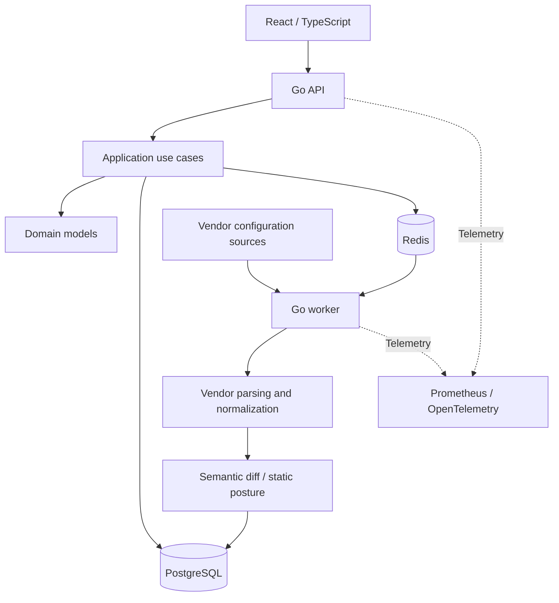

# Architecture overview

NetConfigGuard separates domain models, application use cases, vendor parsing, persistence and transport. A Go API serves a React/TypeScript dashboard; an asynchronous worker handles collection and analysis. PostgreSQL stores application data and Redis supports queue/cache workflows.

## Design choices

- Snapshot history makes configuration changes inspectable over time.
- Semantic analysis distinguishes meaningful changes from raw text differences.
- Static posture analysis can evaluate a configuration without a prior snapshot.
- Findings carry evidence and framework references; an unevaluated result is not represented as success.
- Vendor contracts separate collector, parser, normalizer, rule pack and capability description; catalog membership does not imply equal implementation depth.
- Optional AI explains analysis results and remains advisory.
- Offline installation and local license verification support environments with restricted connectivity.

## Deployment and access

Docker/Compose and Helm deployment paths exist. Authentication includes JWT, API keys, role-based access, MFA/TOTP and configured OIDC. Device credentials are encrypted at rest. Tenant context is enforced in application workflows; this statement is not an independent security audit.

Production exposure requires deployment-specific HTTPS and restricted metrics access. This showcase omits implementation files, internal endpoints and operational credentials.
