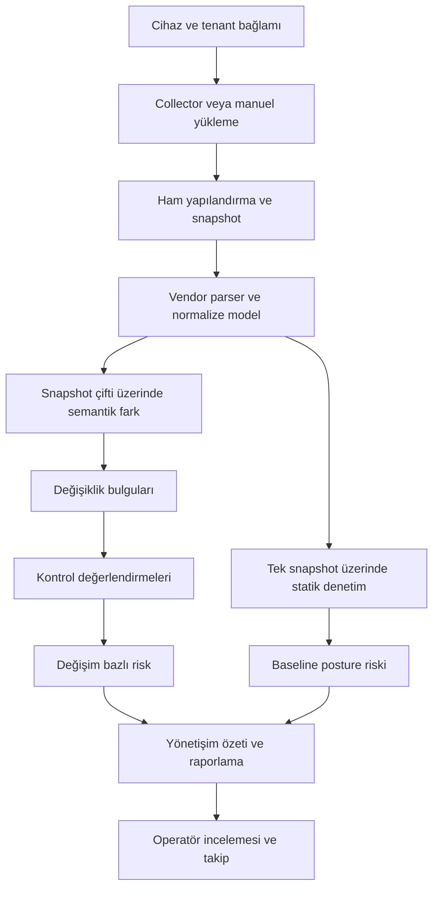

# Ürün: neden NetConfigGuard?

Bir ağ cihazının çalışması, yapılandırmasının güvenli veya değişikliklerinin incelenmiş olduğu anlamına gelmez. Yönetim protokolleri, erişim kuralları, ağ nesneleri ve servis ayarları zaman içinde değişir. Farklı üreticilerde bu değişiklikler farklı yapılandırma biçimleriyle ifade edilir.

NetConfigGuard'ın hedefi bu yapılandırmaları geçmişi ve kanıtı olan yönetişim verisine dönüştürmektir. Operatör yalnızca “dosyada hangi satır değişti?” sorusunu değil, “hangi nesne değişti, güvenlik açısından neden önemli, hangi kontrolle ilişkili ve inceleme önceliği ne?” sorularını da ele alabilir.

## Kimler için?

| Kullanıcı | Üründeki karşılığı |
| --- | --- |
| Ağ operasyon ekibi | Cihaz envanteri, bağlantı testi, toplama işleri, snapshot geçmişi ve karşılaştırma |
| Güvenlik ekibi | Statik denetim, değişiklik bulguları, severity ve risk değerlendirmeleri |
| Yönetişim / denetim ekibi | Kontrol referansları, raporlar, geçmiş değerlendirme bağlamı ve audit izi |
| Platform yöneticisi | Tenant, kullanıcı/rol, lisans, kurulum ve operasyon ayarları |

Bunlar hedef kullanıcı gruplarıdır; müşteri veya production kullanım referansı değildir.

## Uçtan uca değer zinciri

Bir veri kolunun uygulanabilir olması vendor kapsamına, mevcut snapshot sayısına ve ilgili kurallara bağlıdır. Bu şema her cihazda bütün sonuçların üretileceği garantisi değildir.

## Temel kavramlar

| Kavram | Anlamı |
| --- | --- |
| Tenant | Cihazların ve kullanıcı işlemlerinin bağlı olduğu organizasyon bağlamı |
| Device | Analiz edilen üretici/ürün ve bağlantı bilgileri olan kayıt |
| Collection job | Yapılandırma toplama işinin durumu, zamanları ve hata bağlamı |
| Snapshot | Belirli zamanda toplanan ham yapılandırma ve ona ait metadata |
| Semantic diff | Desteklenen yapılandırma nesnelerinin anlamlı değişiklikleri |
| Finding | Kuralla üretilen, kanıt ve önem seviyesi taşıyan gözlem |
| Compliance evaluation | Uygulanan kontrolün değerlendirme sonucu ve referansları |
| Risk assessment | İnceleme önceliğini anlatan, üst veriye dayalı risk çıktısı |
| Lineage | Sonucun hangi snapshot veya snapshot çiftinden geldiği bağlamı |
| Audit event | Kullanıcı ve işlem akışlarını izlemeye yardımcı olay kaydı |

## Ürün konumlandırması

Bu proje yapılandırma yönetişimine odaklanır. Gösterilen bulgu bir sızma testi sonucu, vendor güvenlik garantisi veya sertifikasyon değildir. AI çıktıları tavsiye niteliğindedir. Düzeltmenin uygulanması ve kabulü operatör sorumluluğundadır; otomatik cihaz düzeltmesi bu tanıtımda iddia edilmez.

[Sonraki: kullanıcı yolculuğu](user-journey.md) · [Ana sayfa](../README.md)
