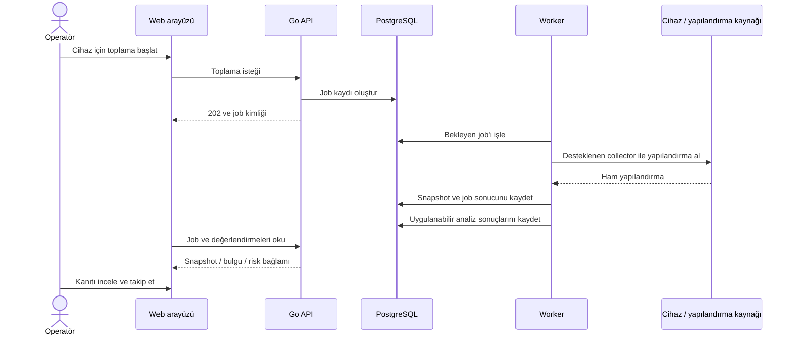

# Kurulumdan raporlamaya kullanıcı yolculuğu

Bu bölüm mevcut ürün akışını anlatır. Canlı müşteri kurulumu veya gerçek cihaz testi kaydı değildir. Arşiv ve uygulama kaynakları public tanıtım deposundan indirilemez; uygulama erişimi için ürün sahibiyle görüşülür.

## 1. Ortamın hazırlanması

Dağıtım modeli Docker/Compose veya Kubernetes/Helm olarak seçilir. API, Worker, web arayüzü, PostgreSQL ve Redis bileşenlerinin ayarları hazırlanır. Offline kurulumda gerekli imajlar ve dosyalar paketle taşınabilir. Dış erişimden önce HTTPS, secrets yönetimi ve ağ erişim sınırları yapılandırılır.

## 2. Tenant, yönetici ve lisans

Yönetici tenant bağlamını ve erişimi hazırlar; geliştirme için kullanılan başlangıç parolası değiştirilir. Ürün lisansı yerel imza doğrulamasından geçirilerek aktive edilir. Lisans tenant, modül ve kapasite bilgileri taşır. Uygulamaya giriş yapmak ile ürün yeteneğine erişmek iki ayrı kontroldür.

## 3. İlk kurulum takibi

Kurulum sihirbazı on adımı takip eder: sistem kontrolü, tenant/admin, lisans aktivasyonu, DB/Redis/Worker sağlığı, SMTP, yedekleme, ilk connector, ilk cihaz, ilk toplama, ilk analiz. İlerleme backend'de tutulur ve kaldığı yerden devam edilebilir.

Sihirbazdaki “Tamamla” veya “Atla” işlemi kurulum ilerlemesini kaydeder. Tek başına bir bağımsız sağlık testi veya cihaz doğrulaması kanıtı değildir.

## 4. Cihaz kaydı ve bağlantı

Operatör cihazın vendor bilgisini ve ilgili bağlantı ayarlarını kayıt altına alır. Gerekli device credentials şifreli saklanır. Connector bulunan vendor'larda bağlantı testi ve toplama yolu kullanılabilir. Dosya tabanlı iş akışında manuel snapshot yüklenebilir. Collector olmayan bir katalog girdisi uzaktan otomatik toplama olarak anlatılmaz.

## 5. İlk snapshot

Toplama bir job oluşturur; uzun süren işlem HTTP isteğinin içinde tamamlanmaya zorlanmaz. Worker işin durumunu ilerletir ve başarılı toplama sonrası ham yapılandırma ile snapshot metadata'sı saklanır. Arayüz job sonucunu izler ve ilgili ekran verilerini yeniler.

İlk snapshot geçmiş için başlangıç noktasıdır. Henüz ikinci snapshot yoksa değişiklik karşılaştırması yapılamaz. Desteklenen vendor'larda statik güvenlik denetimi tek snapshot ile ayrıca değerlendirilebilir.

## 6. İkinci snapshot ve karşılaştırma

Bir sonraki toplama veya manuel yükleme yeni bir snapshot üretir. Operatör son snapshot çiftini ya da geçmişten iki snapshot seçerek karşılaştırabilir. Ham metin farkı dosya değişikliklerini; semantik fark desteklenen nesne ve scope'lardaki anlamlı değişiklikleri gösterir.

## 7. Bulgu, kontrol ve risk incelemesi

Kurallar ilgili kapsamı değerlendirir. Findings, compliance ve risk ayrı veri modelleridir: gözlem, kontrol değerlendirmesi ve inceleme önceliği aynı şey değildir. Kullanıcı kanıta ve snapshot bağlamına dönerek sonucu inceler. Değişim bazlı risk ile statik baseline riski ayrı yorumlanır.

## 8. Rapor ve operasyonel takip

Cihaz detayından raporlama görünümleri ve PDF raporu kullanılabilir. Yapılandırılmış alert kanalları yüksek önem taşıyan sonuçların iletilmesine yardımcı olur. Job ve audit sekmeleri toplama hatası ile analiz hatasını ayırmak için kullanılır. AI açıklaması etkinse bulgu açıklaması veya cihaz bağlamında sohbet tavsiye olarak değerlendirilir.

## 9. Düzeltme sonrası yeniden değerlendirme

Operatör düzeltmeyi kendi değişiklik sürecinde uygular. Yeni snapshot alınır ve önceki bağlamla karşılaştırılır. Bir durumun düzelmesi ilgili kapsamın yeniden değerlendirilmesiyle anlaşılır; yalnızca eski bir bulgunun görünmemesi tüm cihazın güvenli olduğunu kanıtlamaz.

[Arayüz rehberi](interface-guide.md) · [Analiz hattı](analysis-pipeline.md) · [Ana sayfa](../README.md)
