# NetConfigGuard — görsel ürün turu

**Gerçek çalışan uygulama, sentetik laboratuvar verisi.** Bu galeri müşteri ortamı, canlı cihaz doğrulaması veya üretim referansı değildir. Kayıt: 2026-09-17.

[Türkçe seslendirmeli tur](../media/netconfigguard-laboratory-tour-narrated.tr.mp4) · [Sessiz tur](../media/netconfigguard-laboratory-tour.mp4) · [Örnek cihaz raporu (PDF)](../media/netconfigguard-laboratory-report.pdf) · [Ana sayfa](../README.md)

## LinkedIn kısa tanıtımı

[97 saniyelik tanıtım](../media/netconfigguard-linkedin-teaser.tr.mp4), yapılandırma güvenliği sorusuyla açılır; gerçek semantik fark, bulgu kanıtı, risk ve uygulama işlem izini gösterir. Son bölüm gelecekte hedeflenen tek panel yönetimi, cihaz değişikliğini kişiye bağlama ve anlık yönetici bildirimini kavramsal diyagramla anlatır. Bu hedefler mevcut özellik olarak sunulmaz. Format 1080×1350, Türkçe Ahmet Neural sesi ve gömülü altyazıdır. [Bölümler](linkedin-teaser.tr.md) · [Kapak](../images/linkedin-cover.tr.png).

## Ayrıntılı ürün demosu

[Yaklaşık 11 dakika 36 saniyelik Türkçe anlatımlı demo](../media/netconfigguard-product-walkthrough.tr.mp4), her ekranın ne gösterdiğini ve inceleme sürecinde neden kullanıldığını açıklar. Ahmet Neural sentetik sesi kullanılır; gerçek bir kişinin sesi klonlanmaz. Uzun ekranlarda sabit kadrajdan ilgili ayrıntıya geçilir. [Bölüm zamanları ve tam metin](product-walkthrough.tr.md) · [Altyazı](../media/netconfigguard-product-walkthrough.tr.srt).

Risk anlatımı desteklenen analizlerin kapsamıyla sınırlıdır; tüm riskleri veya herkesten önce risk bulma garantisi verilmez.

## Düzenlenmiş video — 2026-09-18

Video 100 saniyelik, sessiz ve açıklamalı bir ürün turudur. Gerçek uygulama ekran görüntülerinden hazırlanmıştır; kesintisiz bir etkileşim kaydı değildir. Sabit 1920×1080 kadraj, ekran başına beş saniye, kısa açıklamalar ve yumuşak geçişler kullanılır. Uzun sayfalarda ilgili görünüm gösterilir; tam ekran görüntüleri aşağıdaki galeridedir. [Video bölümleri ve zamanları](video-chapters.md).

### Türkçe anlatımlı sürüm

Aynı 100 saniyelik ekran turunun Türkçe sentetik seslendirmeli sürümü de bulunur. Her anlatım ilgili beş saniyelik bölümle eşleştirilmiştir. Ses macOS Yelda (tr_TR) sistem sesiyle üretilmiştir; insan anlatımı veya ses klonu değildir. [Anlatım metni](video-narration.tr.md) · [Türkçe altyazı (SRT)](../media/netconfigguard-laboratory-tour.tr.srt).

## Senaryo

HQ firewall'da yönetim erişimi ve politika kapsamı genişletilir; logging/timeout ayarları zayıflatılır. Branch firewall'da bir address object değişir. Cisco router ayrı static posture denetimiyle incelenir. Dördüncü cihazda henüz veri bulunmaz. Böylece dolu sonuçlar kadar değerlendirilmemiş durum da gösterilir.

Dört kayıt oluşturuldu ve üç cihaza toplam altı snapshot API üzerinden yüklendi. Ham yapılandırmalar sentetiktir; findings/compliance/risk çıktıları uygulamanın kendi parser ve analiz hattından gelir. Hazır sayılar veya sahte API yanıtlarıyla dashboard doldurulmadı.

## Kayıt ve sürüm bağlamı

- Uygulama tabanı 0.3.0-alpha.1; kayıt için kullanılan private kaynak commit'i `6e087e1` (`fix/showcase-governance-views`).
- Bu dal dashboard bulk okuma yetki/tenant eşlemesini, geçmiş sorgularının lineage parametresini ve iki yanıltıcı durum metnini düzeltir. Bu düzeltmeler 2026-09-17 tarihinde `main` dalına merge edildi (`b753a68`). Görseller kayıt anındaki dalı gösterir; ilk alpha arşivinin birebir ekran kaydı olduğu iddia edilmez.
- Üstteki laboratuvar şeridi kayıt sırasında eklenen açıklama etiketidir; standart ürün navigasyonunun parçası değildir. Analiz sonucu, sayı ve risk verileri değiştirilmedi.
- Tenant, hesap ve cihaz adları örnektir. Dış alert kanalları ve AI kapalı tutuldu. Kaynak, token, credential ve aktivasyon materyali bu depoda yayımlanmaz.
- Görseller 1920 px genişlikte tarayıcı kayıtlarıdır; yazdırılabilir rapor 1440 px genişlikte yakalandı. Uzun ekranları tam boy açarak inceleyebilirsiniz.

## İnceleme rotası

1. Operasyon kontrol paneli
2. Cihaz envanteri
3. Cihaz genel bakış
4. Snapshot geçmişi
5. Seçilen snapshot çiftinin ham farkı
6. Semantik karşılaştırma
7. Değişiklik bulguları
8. Bulgunun kanıt ayrıntısı
9. Eyleme dönük bildirim adayları
10. Tek snapshot güvenlik denetimi
11. Değişim bazlı risk
12. Kontrol değerlendirmeleri
13. Raporlama çalışma alanı
14. Yazdırılabilir cihaz raporu
15. Denetim izi
16. Politika ve kontrol kataloğu
17. Cisco IOS için statik denetim
18. Verisi olmayan cihaz

## Ekranlar

### 1. Operasyon kontrol paneli

Dört laboratuvar cihazının değişim riski, mevcut duruş riski, bulgu ve kontrol dağılımı birlikte görülür. On bulgu, verinin gerçekten analiz edildiği iki firewall değerlendirmesinden gelir; Cisco kaydının statik denetimi ayrıca görünür. Snapshot bulunmayan cihaz değerlendirilmedi olarak ayrılır.

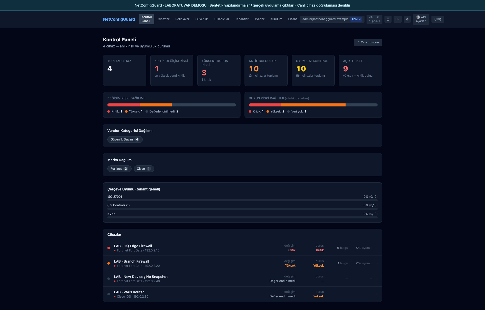

### 2. Cihaz envanteri

HQ firewall, branch firewall, Cisco router ve snapshot bulunmayan yeni kayıt. Device isimleri laboratuvar etiketi taşır; yönetim adresleri örnek senaryo bağlamındadır.

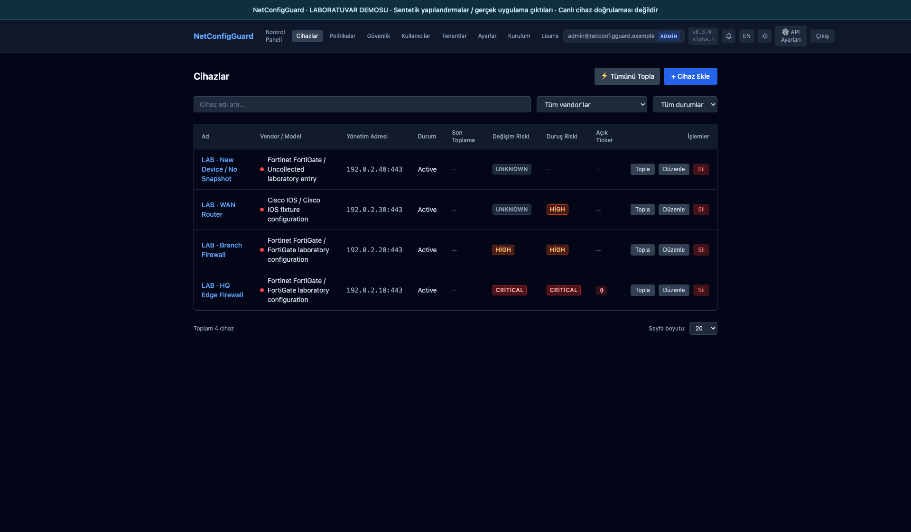

### 3. Cihaz genel bakış

HQ firewall için dokuz değişiklik bulgusu, kontrol/risk çıktıları ve ayrıca on iki statik denetim bulgusu vardır. Değişim riski ile 100/100 baseline posture göstergesi farklı değerlendirmelerdir; yüzde saldırı olasılığı değildir.

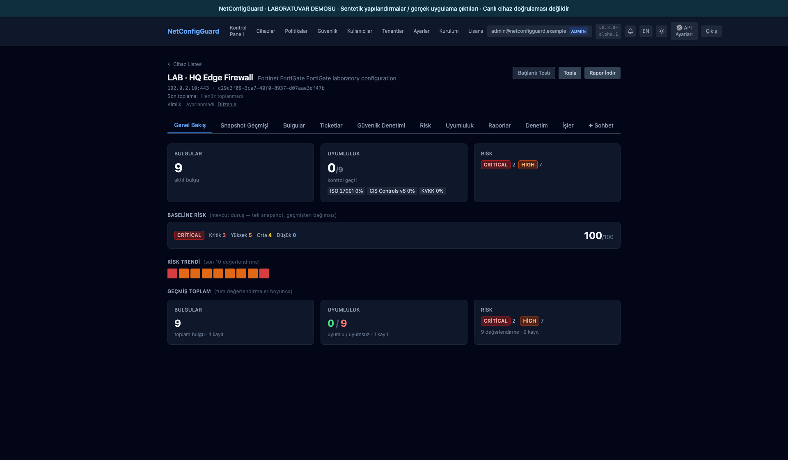

### 4. Snapshot geçmişi

API üzerinden yüklenen iki snapshot ve son yapılandırma karşılaştırması. Manuel yükleme kullanıldığı için cihaz üst bilgisindeki collector son toplama alanı henüz toplanmadı gösterebilir; bu bir canlı cihaz toplama demosu değildir.

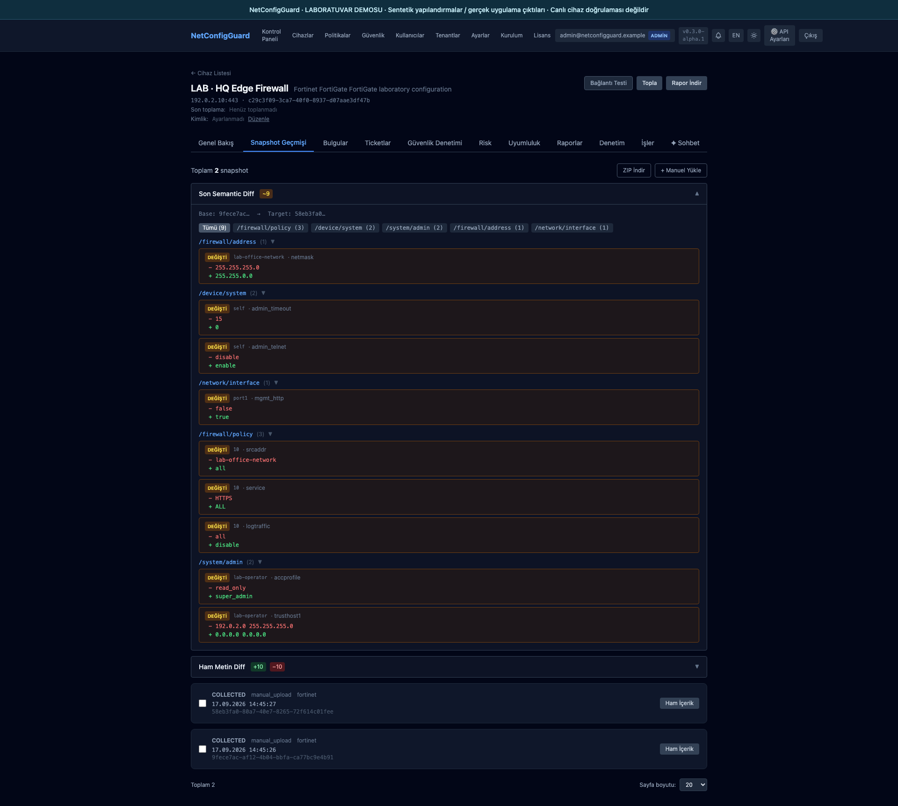

### 5. Seçilen snapshot çiftinin ham farkı

Operatör iki snapshot seçip karşılaştırma penceresini açar. Ham diff yapılandırma satırlarındaki değişiklikleri gösterir.

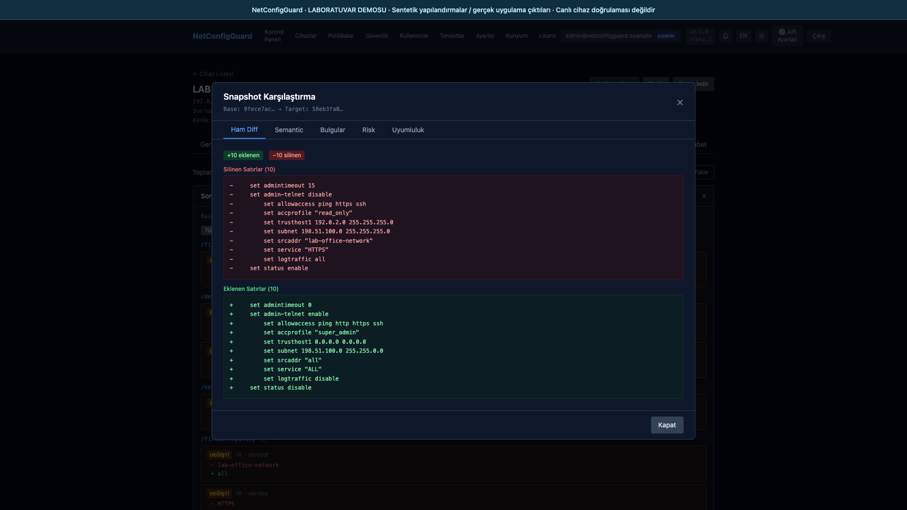

### 6. Semantik karşılaştırma

Aynı snapshot çiftinin desteklenen nesne ve alan değişiklikleri. Metin farkının yanına yapılandırma anlamı eklenir; parser kapsamı dışındaki bütün ayarların değerlendirildiği iddia edilmez.

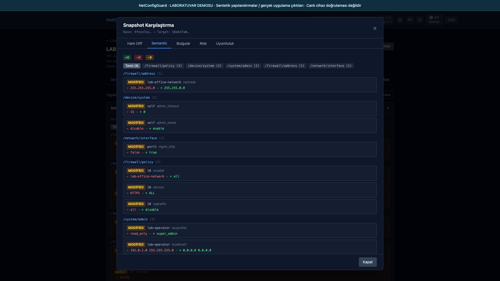

### 7. Değişiklik bulguları

Sentetik senaryoda netmask genişlemesi, yönetim protokolü, timeout, policy, logging ve yönetici kapsamı değişimleri analiz edilir. Dokuz finding uygulama kurallarınca üretildi; ekran sayaçları veya sonuç payloadları elle düzenlenmedi.

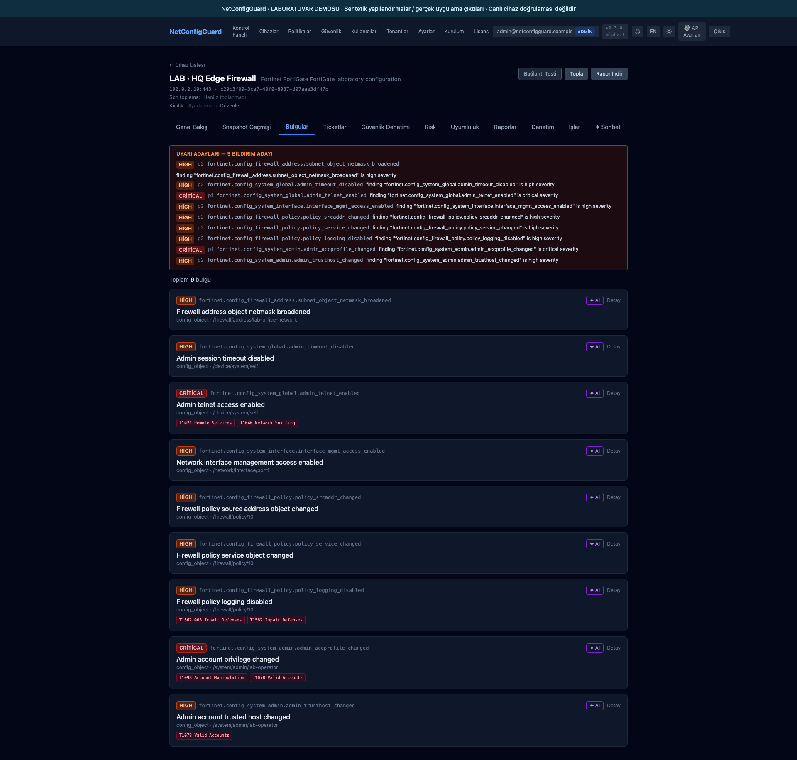

### 8. Bulgunun kanıt ayrıntısı

Bir finding kartının ayrıntısı açılarak ilgili değişikliğin kanıt bağlamı görünür. Kullanıcı özet sonucundan kaynak yapılandırma olgusuna dönebilir.

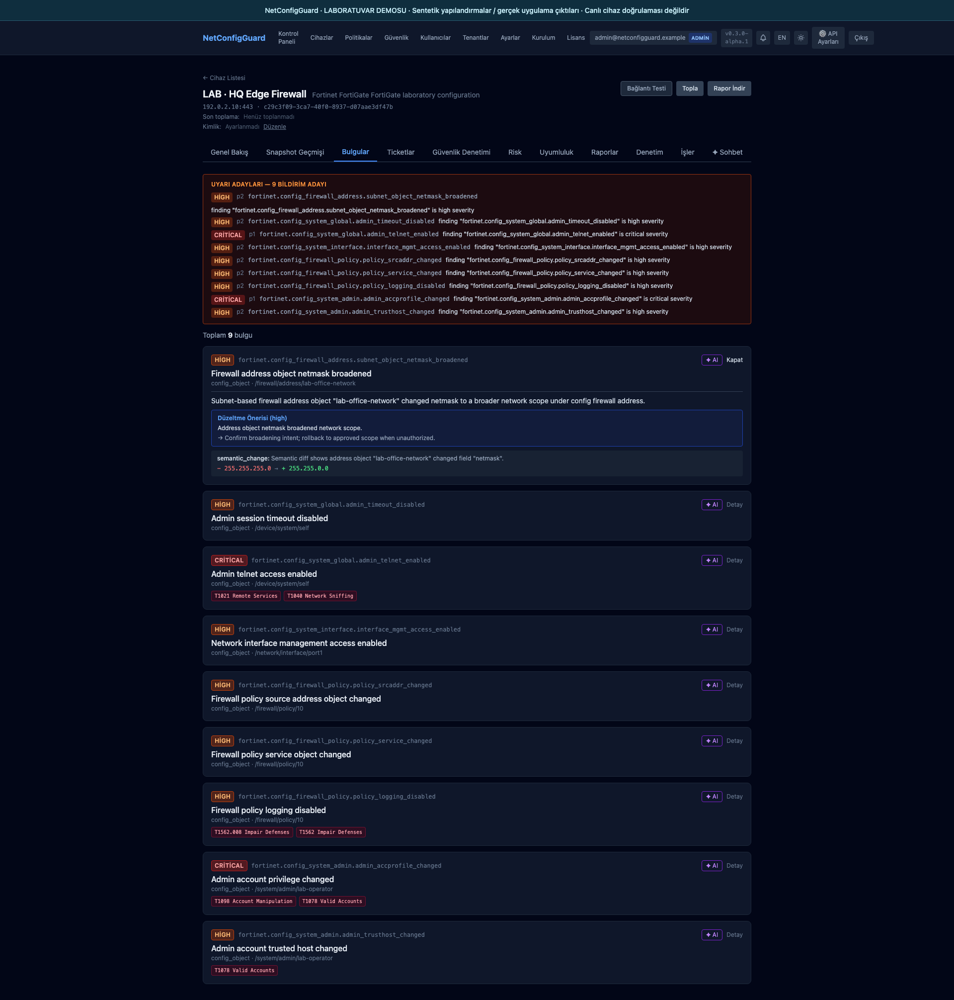

### 9. Eyleme dönük bildirim adayları

High/critical bulgulara ilişkin öncelik ve remediation bağlamı. Buradaki ticket görünümü bildirim adayı verisidir; müşteri ticket sistemi veya gerçekleşmiş Slack/webhook/e-posta teslimi değildir. Kayıtta dış bildirim kanalları kapalıdır.

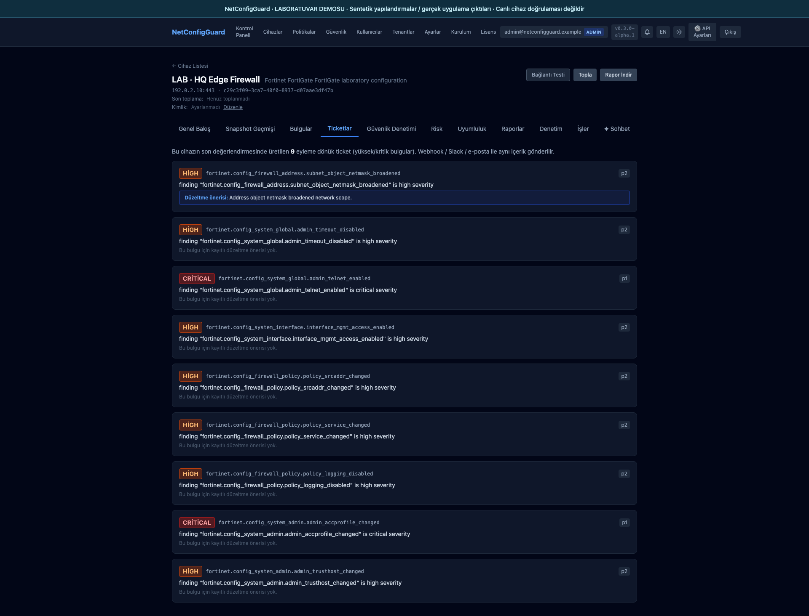

### 10. Tek snapshot güvenlik denetimi

Mevcut yapılandırma üzerinde unrestricted trusthost, super_admin, Telnet, timeout, policy logging ve ilgili posture kuralları değerlendirilir. Bu örnekte 12 statik bulgu, critical band ve 100 skor üretilmiştir.

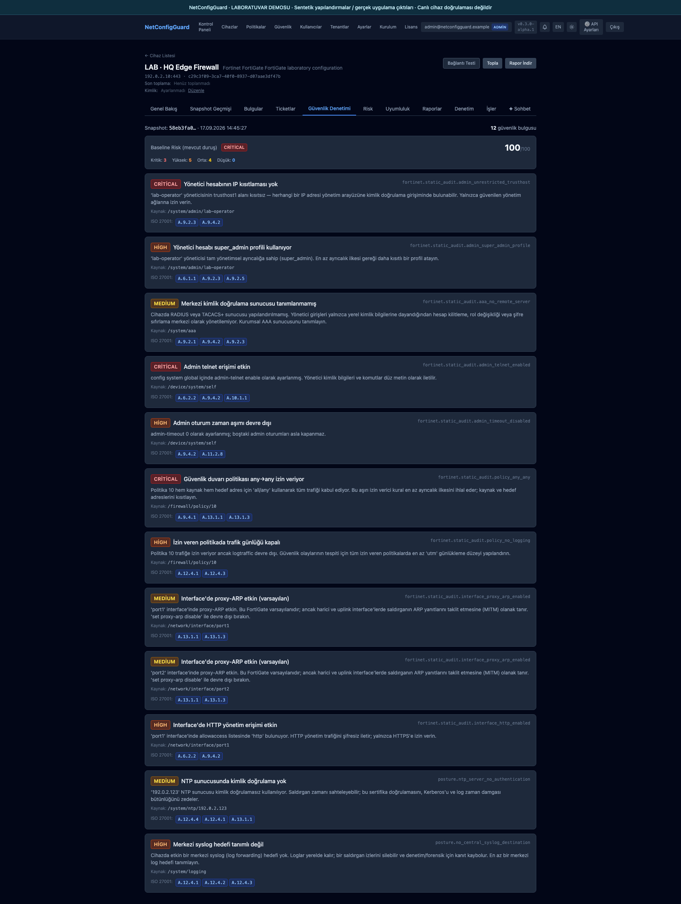

### 11. Değişim bazlı risk

Snapshot çifti ile ilişkili kontrol sonuçlarına dayanan risk assessment kayıtları. HQ senaryosunda iki critical ve yedi high assessment vardır; baseline skoruyla aynı gösterge değildir.

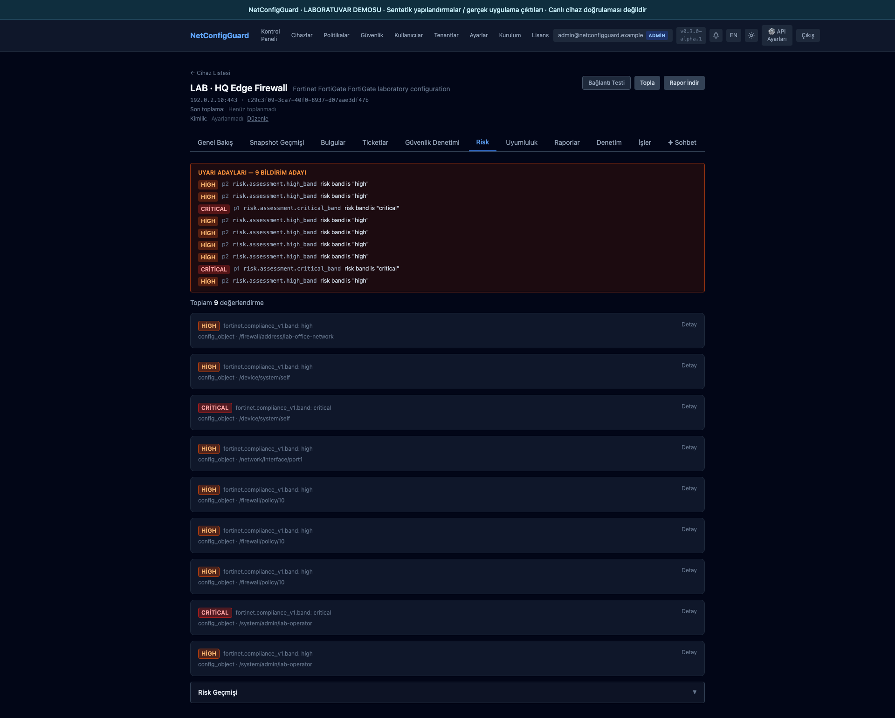

### 12. Kontrol değerlendirmeleri

İlgili kontrol, durum ve framework referansları görülür. Bu senaryoda dokuz desteklenen kontrol non-compliant değerlendirilmiştir. Bu sonuç bütün kurumun ISO/CIS/KVKK uyum oranı veya sertifikasyon sonucu değildir.

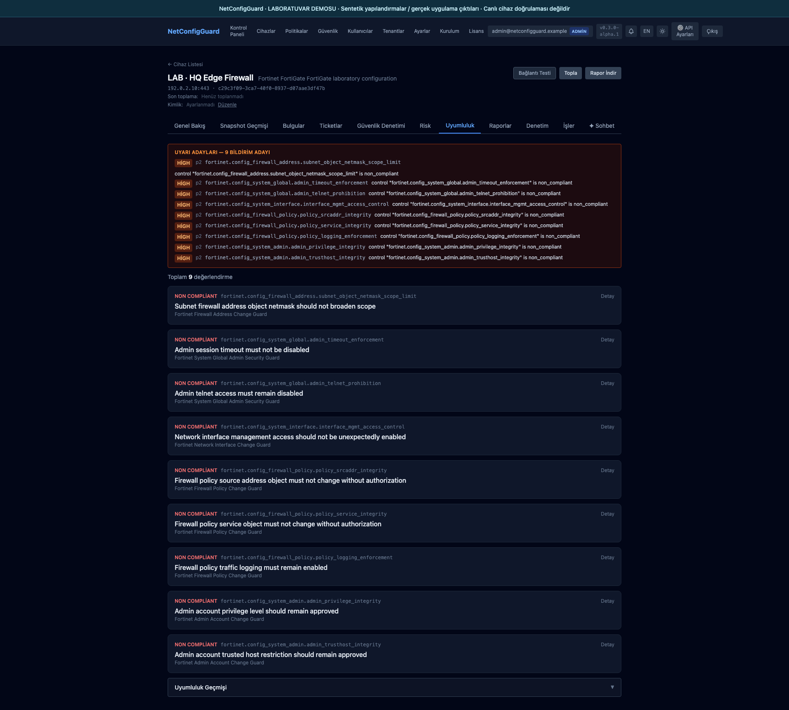

### 13. Raporlama çalışma alanı

Finding, compliance ve risk raporlama verisi arayüzde incelenir. Rapor bağlamı analiz edilen snapshot lineage ile sınırlıdır.

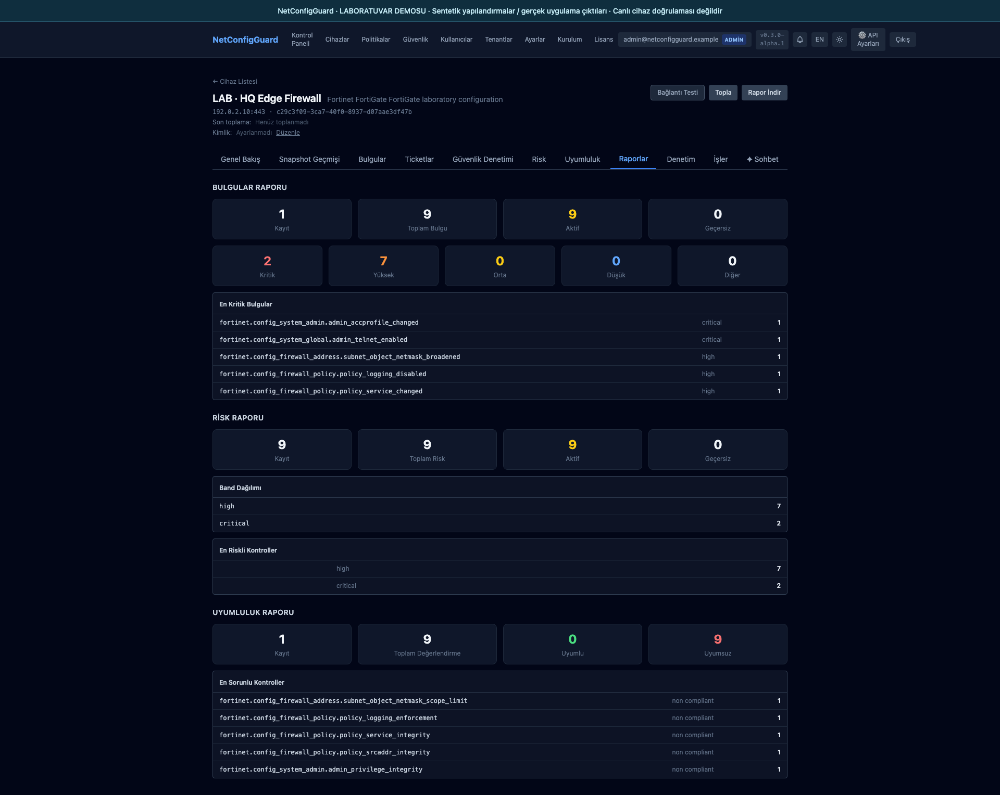

### 14. Yazdırılabilir cihaz raporu

Uygulamanın HTML rapor çıktısı: yönetici özeti, bulgu tablosu, framework/kontrol ve risk bölümleri. Ekteki PDF bu gerçek HTML çıktısının Chromium üzerinden yazdırılmasıyla oluşturulmuştur; endpoint doğrudan binary PDF üretmiyor.

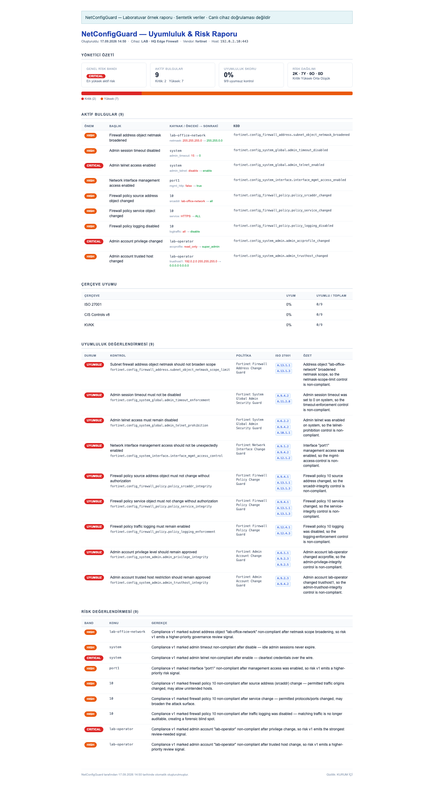

### 15. Denetim izi

Laboratuvarda yapılan gerçek API işlemlerinin audit kayıtları. Olaylar seed SQL ile uydurulmadı; cihaz ve snapshot işlemleri uygulama üzerinden çalıştırıldı.

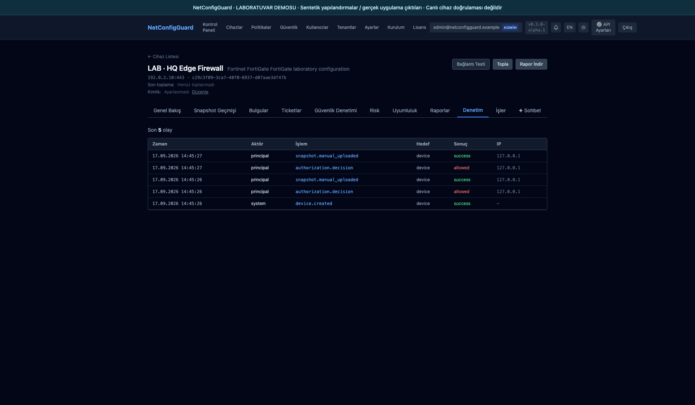

### 16. Politika ve kontrol kataloğu

Mevcut compliance politikaları ve kontrol listeleri. Politika eşlemeleri denetimi destekleyen referanslardır; sertifika değildir. Bu kayıtta AI politika taslağı üretilmedi.

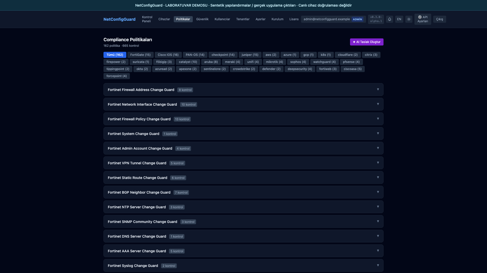

### 17. Cisco IOS için statik denetim

Sanitize edilmiş sentetik Cisco fixture yapılandırması tek snapshot denetiminde incelenir. Bu cihazın değişim materialization verisi eksik olduğundan dashboard değişim bölümünde değerlendirilmedi gösterilir; bu ayrım gizlenmez.

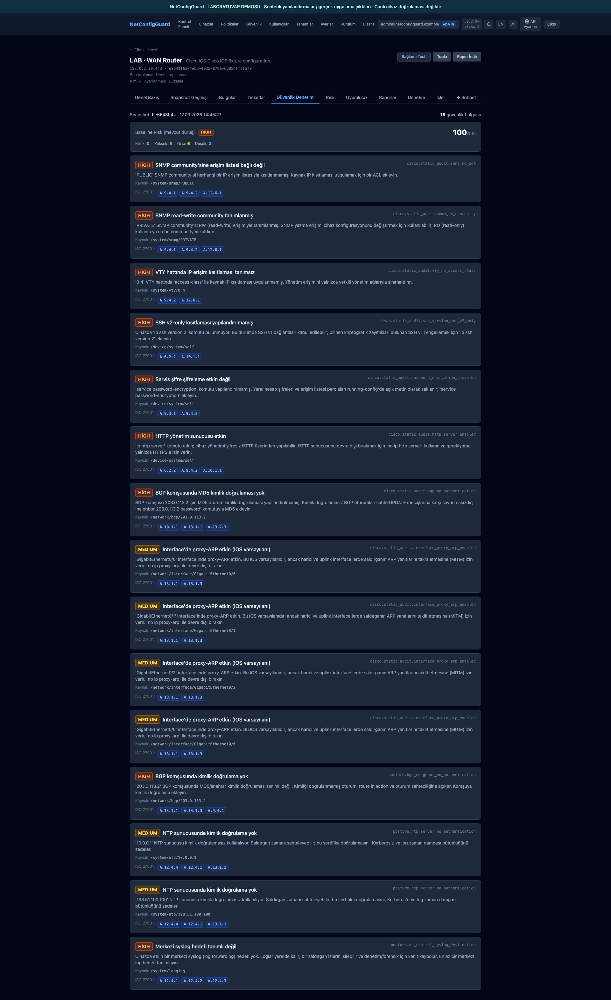

### 18. Verisi olmayan cihaz

Yeni kayıt için henüz snapshot yok. Bu ekran değerlendirilebilir veri olmamasını gösterir; temiz veya güvenli cihaz kanıtı değildir.

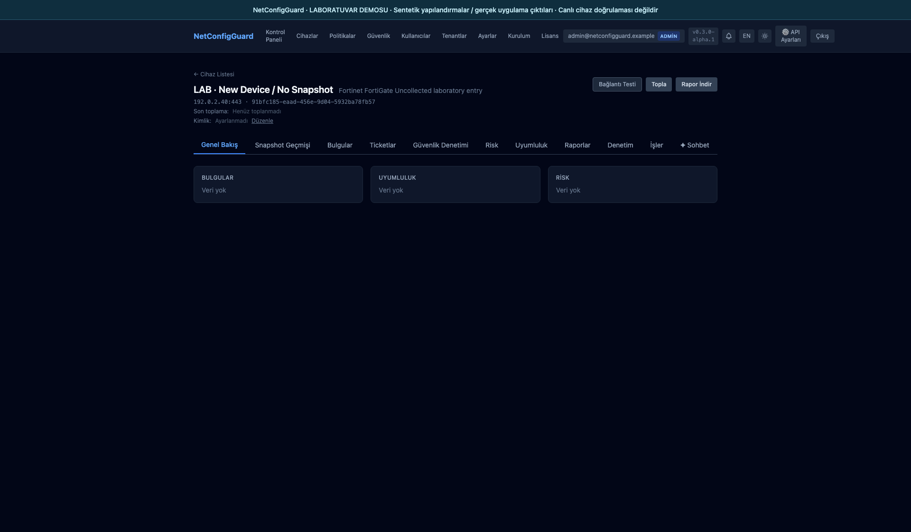

## Ne gösterilmiyor?

Canlı collector bağlantısı, başarılı dış bildirim teslimi, gerçek müşteri yükü, AI sağlayıcı yanıtı, HA/failover veya production pilot kabulü bu kayıtla doğrulanmaz. Snapshot bulunmayan kaydın static audit isteği expected 409 üretir; bunun için değerlendirilmedi durumu gösterilir.

[Uçtan uca yolculuk](user-journey.md) · [Analiz hattı](analysis-pipeline.md) · [Doğrulama ve yol haritası](validation.md)
